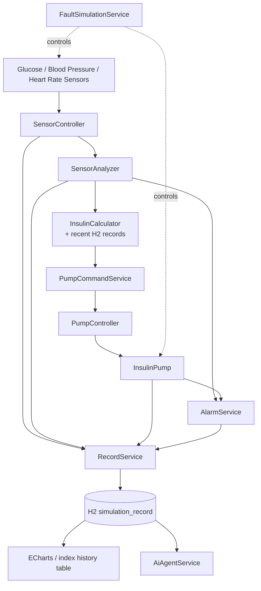
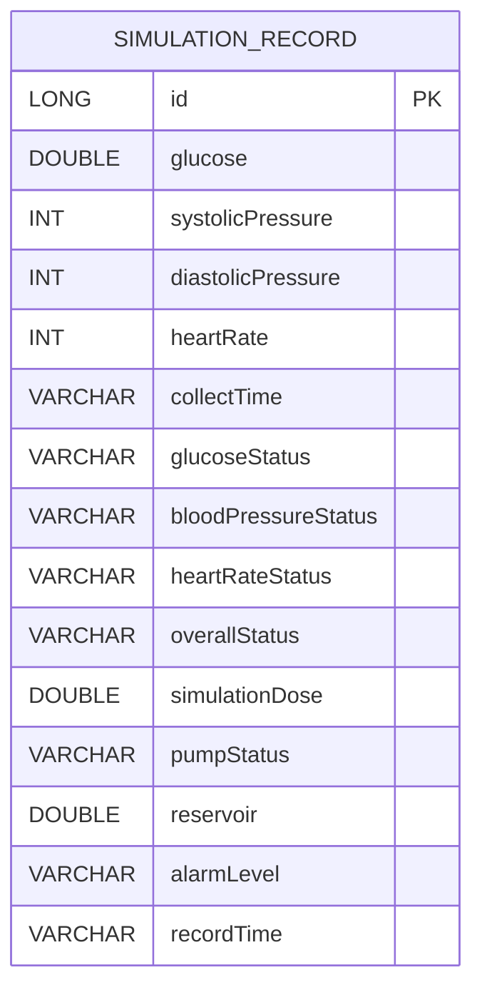

# 项目全过程总结

## 第一章 项目背景

本项目是软件工程实践课程中的 Medical Instrument Simulation / Insulin Pump。系统不连接任何真实硬件，只在 PC 上完成模拟 Sensor、Controller、Pump、Alarm、Display、Data Recording 和 AI Agent 的软件流程验证。系统解决的是课程中的数据采集、分析、控制、记录、可视化和异常处理协同问题。所有血糖阈值、Simulation Dose、Pump 控制量均为教学参数，SU 表示 Simulation Unit，不是真实胰岛素单位。

## 第二章 需求分析

功能需求包括：采集血糖、血压、心率；分析各项状态；计算带历史记录判断的 Simulation Dose；生成 PumpCommand 并控制模拟 Pump；维护 READY/RUNNING/STOPPED/ERROR；提供 NORMAL/WARNING/CRITICAL Alarm；保存 H2 历史记录；在首页、ECharts 和 AI Agent 页面展示；模拟传感器、Pump 和 Power 故障；提供 API 和系统化测试。

非功能需求包括 Java 8 兼容、Spring Boot 2.7.18、端口 9100、文件数据库持久化、输入防御、HTTP 503 故障响应、无外部 AI API、可在无互联网时使用本地 ECharts，以及移动端基础适配。

## 第三章 开发环境

Windows；Java 1.8.0_202；Maven 3.9.11；Spring Boot 2.7.18；Spring Web；Spring Data JPA；H2 2.1.214 文件数据库；HTML/CSS/JavaScript；本地 ECharts；服务端口 9100。

## 第四章 项目目录结构

```text
src/main/java/com/example/insulinpump/
├─ InsulinPumpApplication.java
├─ controller/  SensorController, AnalysisController, InsulinController,
│               PumpController, AlarmController, RecordController,
│               AiAgentController, FaultController
├─ sensor/      GlucoseSensor, BloodPressureSensor, HeartRateSensor
├─ service/     SensorAnalyzer, InsulinCalculator, AlarmService,
│               RecordService, AiAgentService, FaultSimulationService,
│               PumpCommandService
├─ pump/        InsulinPump
├─ model/       SensorData, SensorAnalysisResult, InsulinDoseResult,
│               PumpCommand, PumpStatus, AlarmResult, AiAgentResult,
│               FaultStatus, ApiError
├─ record/      SimulationRecord
├─ repository/  SimulationRecordRepository
└─ exception/   SensorException, GlobalExceptionHandler
src/main/resources/
├─ application.properties
└─ static/ index.html, charts.html, ai-agent.html, js/echarts.min.js
```

`controller` 对外提供 REST API；`sensor` 生成仿真读数；`service` 包含分析、计算、命令、报警、记录、AI 和故障规则；`pump` 管理模拟设备；`record/repository` 对应 JPA Entity 和数据库访问；`model` 是 JSON 数据结构；`static` 是三个前端页面。

## 第五章 项目开发全过程

### 第1阶段 项目初始化

建立 Maven 工程、包结构和 `pom.xml`，选择 Java 8 兼容的 Spring Boot 2.7.18。结果是项目具备可编译基础。

### 第2阶段 Spring Boot 基础运行

创建 `InsulinPumpApplication.java`，配置 `application.properties`，将端口设为 9100。通过 `mvn spring-boot:run` 验证启动。

### 第3阶段 模拟 Sensor

创建三个 Sensor 和 `SensorData`。每次读取生成课程仿真血糖、血压、心率，并记录 `collectTime`。`SensorController` 提供 `/api/sensor/current`。

### 第4阶段 前端显示

创建 `static/index.html`，显示三个传感器卡片和采集按钮。JavaScript 调用 Sensor API 并更新页面。

### 第5阶段 Sensor Analyzer

创建 `SensorAnalyzer`、`SensorAnalysisResult`、`AnalysisController`。规则把血糖、血压、心率分为正常或异常，并按异常项目数生成综合状态。

### 第6阶段 前端分析

首页增加生理数据分析区。采集成功后调用 `/api/analysis/analyze`，显示各项状态、综合状态和说明。

### 第7阶段 Simulation Dose

创建 `InsulinCalculator`、`InsulinDoseResult`、`InsulinController`。课程公式使用目标 6.0、系数 0.5、最大 5.0 SU，并返回 `NO_DELIVERY` 或 `READY`。最终收尾后增加历史记录读取、`HISTORY_LIMIT`、历史记录数量和限制标志。

### 第8阶段 Pump

创建 `InsulinPump`、`PumpStatus`、`PumpController`。Pump 初始 Reservoir 为 100 SU，正常输注后进入 RUNNING 并扣减，支持 stop、reset、ERROR。

### 第9阶段 Pump 前端集成

首页将 Dose 计算结果传给 `/api/pump/deliver`，显示 Pump 状态、Reservoir 和 Last Dose，并防止同一控制量重复执行。

### 第10阶段 Alarm

创建 `AlarmService`、`AlarmResult`、`AlarmController`。根据生理数据、Reservoir 和 Pump 状态生成 NORMAL、WARNING、CRITICAL。

### 第11阶段 Alarm 前端集成

首页增加 Alarm 面板、等级颜色、标题、消息列表和时间，并在 Sensor/Pump 状态变化后重新检查。

### 第12阶段 H2 Data Recording

创建 `SimulationRecord`、`SimulationRecordRepository`、`RecordService`、`RecordController`。实体映射表 `simulation_record`，保存 Sensor、Analyzer、Dose、Pump 和 Alarm 数据，后端统一生成 `recordTime`。

### 第13阶段 历史记录前端

首页增加历史记录数量、刷新按钮和表格，调用 `/api/records` 动态渲染数据库记录。

### 第14阶段 ECharts

将 `echarts.min.js` 放在本地，创建 `charts.html`。从历史记录绘制血糖趋势、心率趋势、Simulation Dose 趋势和 Alarm 分布，支持刷新和响应式尺寸调整。

### 第15阶段 AI Agent

创建 `AiAgentService`、`AiAgentResult`、`AiAgentController`、`ai-agent.html`。Agent 复用 Analyzer、Alarm，读取最近 5 条历史记录，输出生理总结、趋势、Pump、Alarm、异常和监测建议。状态映射为 STABLE、ATTENTION、ALERT。

### 第16阶段 Fault Simulation

创建 `FaultSimulationService`、`FaultController`、`FaultStatus`、`SensorException`、`GlobalExceptionHandler`、`ApiError`。支持三类 Sensor Failure、Pump Failure、Power Failure；非法负数、NaN、Infinity、超过 5.0、Reservoir 不足和设备故障都会被阻止。Sensor 故障通过 HTTP 503 和 `SENSOR_FAILURE` 返回。

### 第17阶段 系统测试

执行 `mvn clean compile` 和 `mvn spring-boot:run`，实际 HTTP 验证 T01-T26。新增 4 个单元测试全部通过。完整结果见 `docs/第17阶段_系统化测试报告.md`。

### 最终收尾 A Historical Records

修改 `InsulinCalculator`、`InsulinDoseResult` 和首页脚本。Calculator 注入 `SimulationRecordRepository`，查询最近 5 条记录；若其中存在 `simulationDose >= 4.0 SU`，返回 `HISTORY_LIMIT`，控制量为 0，并通过 `historyRecordCount`、`historicalDoseLimitApplied` 公开判断依据。这是课程软件仿真安全机制，不是真实医疗规则。

### 最终收尾 B PumpCommand

新增 `PumpCommandService`。`PumpController` 的 deliver 先生成 `PumpCommand("DELIVER", dose)`，再交给服务执行；stop 使用 `STOP`；服务还支持 `NO_ACTION` 和未知命令防御。PumpCommand 因此已经位于真实控制链路中，而不是闲置模型。reset 保持原有设备维护行为。

## 第六章 系统总体架构



## 第七章 数据库设计

H2 使用 `jdbc:h2:file:./data/insulin_pump_db`，数据保存在 `data/insulin_pump_db.mv.db`，应用重启后仍保留。`SimulationRecord` 映射表 `simulation_record`，Repository 继承 `JpaRepository<SimulationRecord, Long>`，并提供 ID 倒序查询。

主要字段：`id` 主键；`glucose`、`systolicPressure`、`diastolicPressure`、`heartRate`、`collectTime` 保存 Sensor；`glucoseStatus`、`bloodPressureStatus`、`heartRateStatus`、`overallStatus` 保存 Analyzer；`simulationDose` 保存 SU；`pumpStatus`、`reservoir` 保存 Pump；`alarmLevel` 保存 Alarm；`recordTime` 保存写库时间。



## 第八章 核心算法和规则

- Sensor：使用随机数生成教学仿真数据。
- Analyzer：按课程阈值生成单项和综合状态。
- Simulation Dose：目标 6.0、系数 0.5、上限 5.0 SU；低于目标为 NO_DELIVERY。
- Historical Records：读取最近 5 条；近期有 4.0 SU 或更大控制量则 HISTORY_LIMIT。
- PumpCommand：DELIVER 执行输注，STOP 停止，NO_ACTION 不动作，未知命令拒绝。
- Reservoir：初始 100 SU，成功执行后扣除控制量，不足则 ERROR。
- Alarm：无异常 NORMAL，普通异常 WARNING，严重血糖、Reservoir 或 Pump 错误 CRITICAL。
- AI Agent：复用 Analyzer/Alarm，结合最近 5 条记录做趋势和规则推理。
- Fault Simulation：故障开关控制 Sensor/Pump，统一处理传感器异常。

以上全部规则仅用于软件工程课程仿真，不是医疗标准，不用于真实诊断、治疗或给药。

## 第九章 REST API

| Method | URL | 参数 | 返回值 | 功能 |
|---|---|---|---|---|
| GET | `/api/sensor/current` | 无 | SensorData | 当前模拟数据 |
| GET | `/api/analysis/analyze` | glucose, systolic, diastolic, heartRate | SensorAnalysisResult | 生理分析 |
| GET | `/api/insulin/calculate` | glucose | InsulinDoseResult | 仿真控制量和历史判断 |
| GET | `/api/pump/status` | 无 | PumpStatus | Pump 状态 |
| POST | `/api/pump/deliver` | dose | PumpStatus | 通过 PumpCommand 输注 |
| POST | `/api/pump/stop` | 无 | PumpStatus | STOP 命令 |
| POST | `/api/pump/reset` | 无 | PumpStatus | 重置设备 |
| GET | `/api/alarm/check` | glucose, systolic, diastolic, heartRate, reservoir, pumpStatus | AlarmResult | 报警检查 |
| POST | `/api/records` | JSON SimulationRecord | SimulationRecord | 持久化 |
| GET | `/api/records` | 无 | List | 查询历史 |
| GET | `/api/records/count` | 无 | long | 统计记录 |
| GET | `/api/ai/analyze` | 生理数据、reservoir、pumpStatus | AiAgentResult | Agent 分析 |
| GET/POST | `/api/fault/status`、`/api/fault/*` | enabled | FaultStatus | 故障仿真 |

## 第十章 前端页面

`index.html` 是主控制台，负责采集、分析、报警、Dose、Pump、记录和历史表格；`charts.html` 从 H2 读取记录并绘制四种 ECharts；`ai-agent.html` 获取当前 Sensor/Pump 数据并展示 Rule-Based Agent 输出。

## 第十一章 AI Agent

Perception 读取当前 Sensor 和 Pump；Memory 读取 H2 最近 5 条记录；Reasoning 复用 Analyzer、Alarm 并比较历史血糖趋势；Output 输出摘要、异常、建议和状态。NORMAL 映射 STABLE，WARNING 映射 ATTENTION，CRITICAL 映射 ALERT。它不调用外部大模型，规则、记忆、推理和输出均由 Java 服务完成，因此属于 Rule-Based Intelligent Agent。

## 第十二章 软件可靠性设计

Sensor Failure 抛出 `SensorException`，`GlobalExceptionHandler` 转换为 HTTP 503 和 `SENSOR_FAILURE`；Pump/Power Failure 阻止执行并返回 ERROR；Pump 检查负数、NaN、Infinity、5.0 上限和 Reservoir；故障服务提供 reset。控制量和状态检查均在后端重复执行，不能只依赖前端按钮禁用。

## 第十三章 测试

第17阶段实际完成编译、启动、HTTP API、H2 重启持久化、故障和端到端验证。主测试 24 PASS、2 PARTIAL；PARTIAL 是当前环境没有浏览器自动化，不能自动确认 ECharts 视觉渲染。新增 4 个单元测试全部 PASS。详情见测试报告。

## 第十四章 项目开发中实际遇到的问题

- 8080 端口被占用：改为 9100。
- Maven 下载 Byte Buddy 中途中断：删除损坏的 `.m2` 缓存后重新下载。
- `ai-agent.html` 404：检查 `static` 目录和文件名。
- 浏览器翻译插件导致 JSON 字段看起来被翻译：确认后端字段实际未改变。
- 本次 PowerShell 输出中文乱码：属于终端编码显示问题，HTTP 响应状态和 JSON 结构正常。
- 测试期间 `mvn clean` 会删除 target：最终重新打包并重启，避免使用旧 JVM。

## 第十五章 最终项目运行方法

进入 `E:\computerProgram2\insulin-pump-simulation`，执行 `mvn spring-boot:run`。停止时在运行窗口按 `Ctrl+C`；页面地址为 `/`、`/charts.html`、`/ai-agent.html`；H2 地址为 `/h2-console`，JDBC 使用 `jdbc:h2:file:./data/insulin_pump_db`、用户 `sa`、空密码。故障测试后执行 `POST /api/fault/reset`，必要时再执行 `POST /api/pump/reset`。

## 第十六章 实验报告可使用的截图清单

本次环境没有浏览器自动截图能力，因此没有伪造 `docs/screenshots` 图片。建议人工截取并保存到该目录：启动日志；主控制台；Sensor/Analyzer；NORMAL/WARNING/CRITICAL；Dose READY；Pump RUNNING/STOPPED/RESET；H2 和历史表格；charts 四图；AI 三状态；Sensor 503、Pump Failure、Power Failure、非法 Dose；完整端到端结果。可将同一页面的相关状态合并截图，优先清晰和可复核。

## 第十七章 项目最终完成情况

- Sensor ✅
- Analyzer ✅
- Dose ✅
- Historical Records ✅
- PumpCommand ✅
- Pump ✅
- Alarm ✅
- Data Recording ✅
- H2 ✅
- ECharts：接口和页面资源已验证，视觉渲染待人工确认
- AI Agent ✅
- Fault Simulation ✅
- Testing ✅

最终构建应以 `mvn clean package` 的 `BUILD SUCCESS` 为准。
